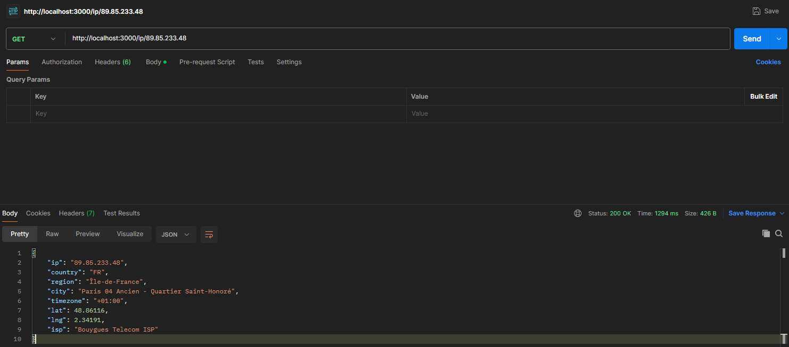
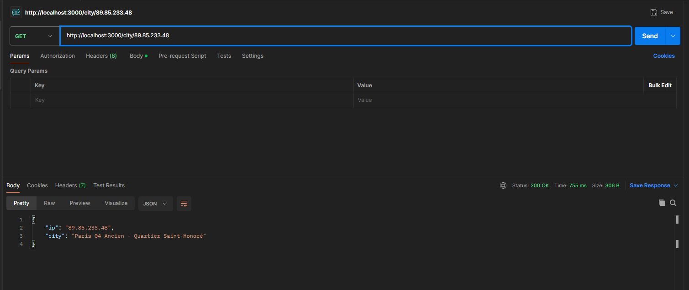
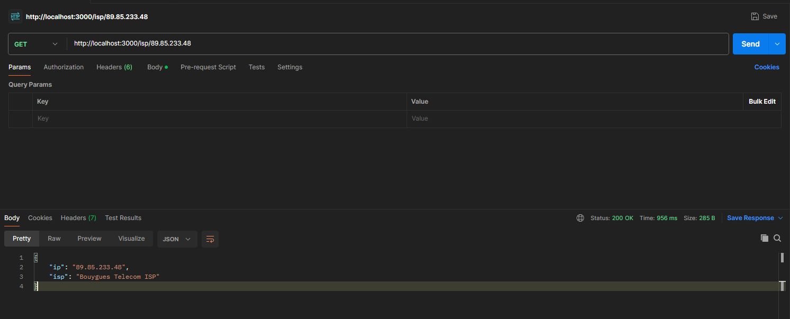

# IP Geo Localisation 🌍

Ce petit projet simple a été réalisé dans le but du module Documentation technique (Readme et apiDoc) de notre cursus de 2eme année de Bachelor dev web et application.

Ce dépot github contient le rendu du projet de fin effectué et rendu le 08/02.

# Fonctionalités principales ✔️

Cette API permet d'obtenir différentes informations en utilisant une IP, il peut renvoyer par exemple la localisation, la timezone, le fourniseur internet, etc...

# Initialisation + Librairies ⚙️

### Front

Pour que le projet fonctionne comme voulu il est reccommandé de suivre les étapes ci-dessous dans l'ordre dans lequel elles sont données.

Inititialisation : `npm init -y`

Typescript : `npm install typescript --save-dev` puis `npx tsc --init` pour initialiser le projet TS pour obtenir tsconfig.json.

Axios : `npm install axios` qui nous servira à faire des requêtes HTTP.

Ensuite, créer le dossier Front puis y mettre tout les document.

### Back

Il faut créer le dossier back, cd dedans, puis effectuer les commandes suivantes :

Inititialisation : `npm init -y`

TypeScript + Express : `npm install @types/express @types/node` notre librairie pour gérer le serveur.

Nodemon : `npm install nodemon --save-dev` pour faciliter le lancement du serveur à chaque modification.

Dotenv : `npm install dotenv` pour faciliter les variables telles que le port, la clé API, etc...

Swagger : `npm install --save-dev @types/swagger-jsdoc @types/swagger-ui-express` pour avoir une page qui explique chacune des méthodes.

# Configuration requise 💻

Assurez vous que vos dépendences sont bien à jour ou dans une version supérieure a la liste suivante : 

    "@types/express": "^4.17.21",
    "@types/node": "^20.11.16",
    "axios": "^1.6.7",
    "dotenv": "^16.4.1",
    "express": "^4.18.2",
    "swagger-jsdoc": "^6.2.8",
    "swagger-ui-express": "^5.0.0",
    "ts-node": "^10.9.2"

# Utilisation de l'API 🧑‍💻

Pour utiliser l'API, étant donné que nous travaillons sur un projet uniquement en back-end, il faudra utiliser l'URL pour rentrer les paramètres de recherche.

Quel que soit la route, celui-ci devra être entré à la fin de l'URL après le dernier `/`, voici un petit exemple de comment faire : `http://localhost:3000/ROUTEADEFINIR/127.0.0.1`

Les différentes routes de l'API et leurs fonctionalités seront visible sur la page http://localhost:3000/api-docs/ une fois que votre application sera fonctionelle.

Vous pouvez maintenant utiliser l'application comme bon vous semble en effectutant des requêtes de votre choix grâce à des outils tels que [Postman](https://www.postman.com/).

Exemple 1:

Exemple 2:

Exemple 3:

[Lien vers l'API](https://geo.ipify.org/docs)